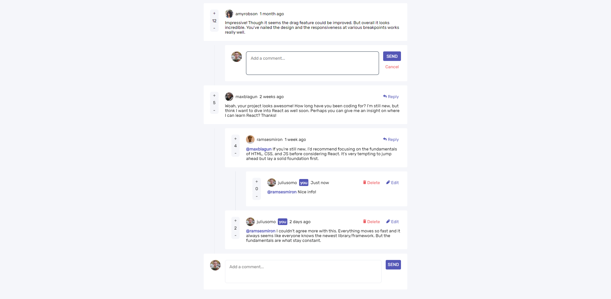

# Frontend Mentor - Interactive comments section solution

This is a solution to the [Interactive comments section challenge on Frontend Mentor](https://www.frontendmentor.io/challenges/interactive-comments-section-iG1RugEG9). Frontend Mentor challenges help you improve your coding skills by building realistic projects.

## Table of contents

- [Overview](#overview)
  - [The challenge](#the-challenge)
  - [Screenshot](#screenshot)
  - [Links](#links)
- [My process](#my-process)
  - [Built with](#built-with)
  - [What I learned](#what-i-learned)
  - [Continued development](#continued-development)
  - [Useful resources](#useful-resources)
- [Author](#author)
- [Acknowledgments](#acknowledgments)

**Note: Delete this note and update the table of contents based on what sections you keep.**

## Overview

### The challenge

Users should be able to:

- View the optimal layout for the app depending on their device's screen size
- See hover states for all interactive elements on the page
- Create, Read, Update, and Delete comments and replies
- Upvote and downvote comments
- **Bonus**: If you're building a purely front-end project, use `localStorage` to save the current state in the browser that persists when the browser is refreshed.
- **Bonus**: Instead of using the `createdAt` strings from the `data.json` file, try using timestamps and dynamically track the time since the comment or reply was posted.

### Screenshot



### Links

- Solution URL: [TBD]()
- Live Site URL: [TBD]()

## My process

### Built with

- Static HTML
- CSS custom properties
- Flexbox
- Mobile responsive
- [React](https://reactjs.org/) - JS library

### What I learned

- Interactive & multi-level nested comment thread
- Recursive rendering function :

```js
const renderComment = (comments, indentLevel = 0) => {
  return comments.map((comment) => (
    <Fragment key={comment.id}>
      <Comment
        currentUser={currentUser}
        comment={comment}
        indentLevel={indentLevel}
        isEditing={comment.id === editCommentId}
        isReplying={comment.id === replyToCommentId}
        editComment={(commentId) => setEditCommentId(commentId)}
        replyToComment={(commentId) => setReplyToCommentId(commentId)}
        onUpdateComment={onUpdateComment}
        onDeleteComment={onDeleteComment}
      />
      {renderComment(comment.replies, indentLevel + 1)}
      {replyToCommentId === comment.id && (
        <CommentReplyForm
          currentUser={currentUser}
          indentLevel={indentLevel + 1}
          isReplying={comment.id === replyToCommentId}
          commentReplyId={comment.id}
          onCancelReply={() => setReplyToCommentId(null)}
          onSubmitReply={onSubmitReply}
          autoFocus
        />
      )}
    </Fragment>
  ));
};
```

Implementation :

```js
let commentsView = renderComment(comments, 0);
```

```js
return (
  <Fragment>
    <div className="comments">
      {commentsView}
      <CommentReplyForm
        currentUser={currentUser}
        onSubmitReply={onSubmitReply}
      />
    </div>
  </Fragment>
);
```

### Continued development

To Do(s):

- use api

### Useful resources

## Author

- Website - [Fauzan Rianda](https://github.com/fauzanr)
- Frontend Mentor - [@fauzanr](https://www.frontendmentor.io/profile/fauzanr)
- Linkedin - [Fauzan Rianda](https://www.linkedin.com/in/fauzanr/)

## Acknowledgments

Thank you [Frontend Mentor](https://www.frontendmentor.io) for this challenge!
